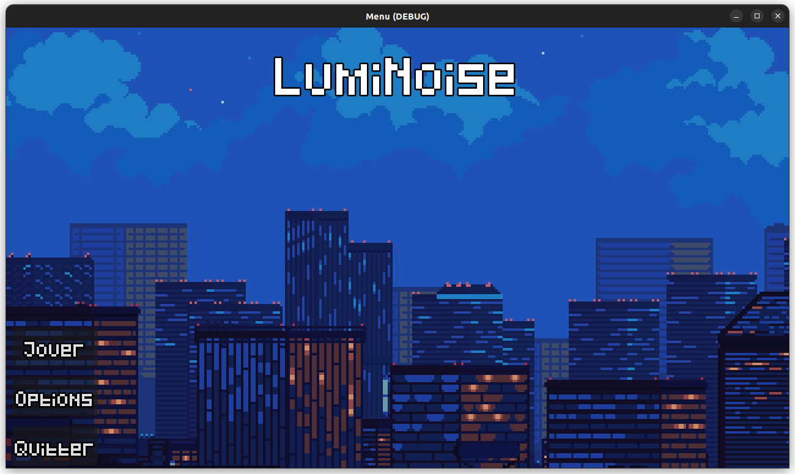
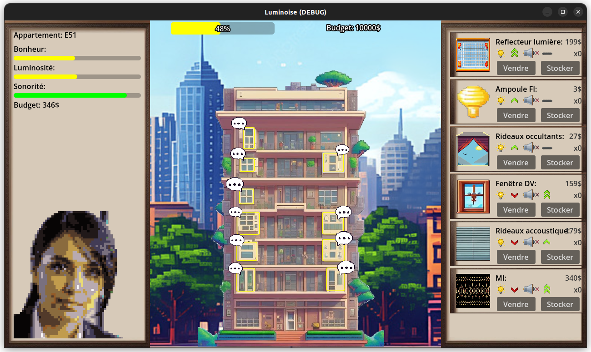

# Luminoise

## Contexte
Ce projet a été réalisé dans le cadre de la matière Jeu sérieux dans le master informatique IMAGINE de la faculté des sciences de Montpellier.

Encadrant:
- Nicolas LUTZ

Etudiants:
- Jean-Baptiste BES
- Adam BONBON
- Evan COMBOT
- Pierre RICHARD

Date: 18 Septembre 2024 - 30 Octobre 2024

## Gameplay

Dans ce jeu le but est de garder les locataires heureux en leur vendant des produits qui répondront à ces besoins. Pour cela il faudrait stocker les objets au préalable. Si les habitants sont trop malheureux ils partiront ce qui rendra l'objectif d'avoir un bonheur global élevé très compliqué.

Ce jeu rentre dans la catégorie jeu sérieux car nous vendont les produits d'une entreprise fictive dans le jeu.